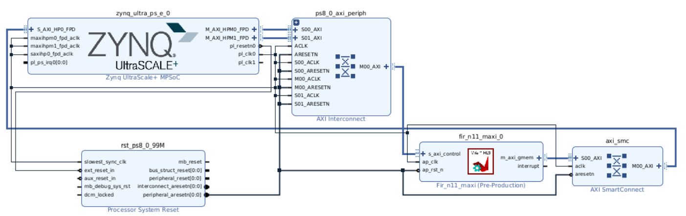
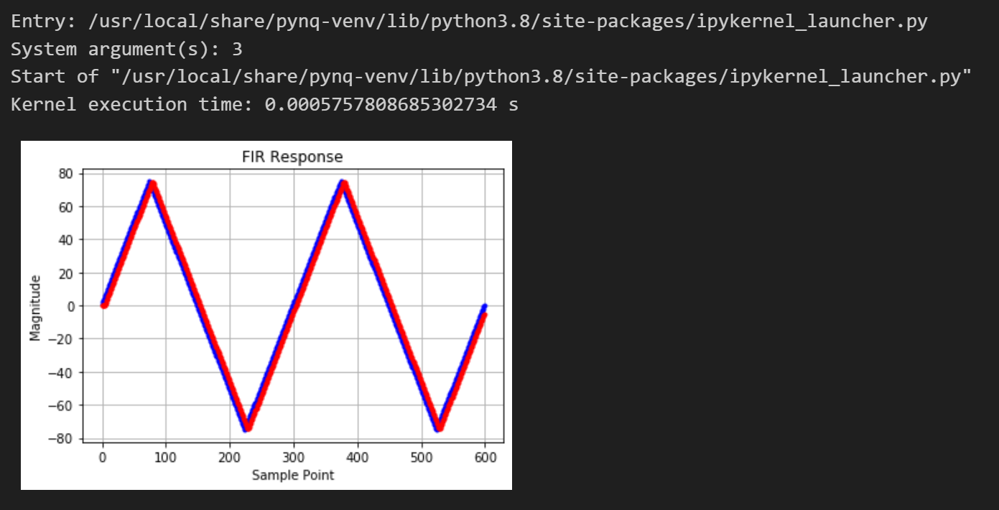
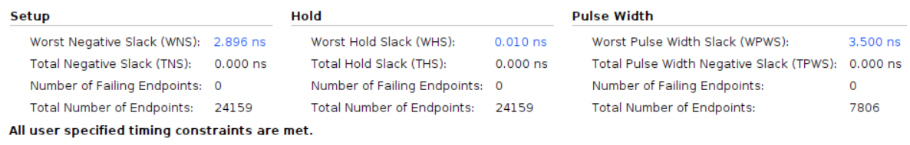

# FIR (AXI-Master)

Employing the KV260 board (part xck26-sfvc784-2LV-c) with a clock period of 10ns.

## Design

This design constitutes FIR using AXI-Master Interface. The primary objective of this lab is to acquaint participants with the HLS tool and its workflow. The design is initially created in C++ and subsequently synthesized into Verilog. Following that, the design is implemented in Vivado and synthesized into a bitstream. The validation of the design takes place on the KV260 board, accomplished from within the Jupyter notebook environment.

### Block Design 

## Results

The results of the design have been verified as accurate. The results are as follows:

### Screenshot of the Results from Jupyter Notebook

### Utilization

### Timing

## Reference
[course-lab_2](https://github.com/bol-edu/course-lab_2.git)