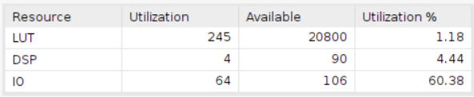
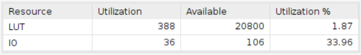

# Interger Division Modulus

Employing the Basys 3 board with a clock period of 10ns.

**In Vitis HLS, if the clock period is configured to be less than 40ns, the design will transform into a sequential circuit configuration due to the latency introduced. However, it's worth noting that the design is capable of completing within a single clock cycle of 10ns, as confirmed through verification in Vivado.**

## Design

The objective of this design is to decrease the latency of the modulus operation by incorporating a division-based modulus approach.

    a % b = a - ( a / b ) * b

* Input Signals:
  * `a`: This signal is the dividend.
* Output Signals:
  * `r`: This signal represents the remainder of the division by 10 (a % 10).

## Result comparison

| Waveform  |        |
|--------|--------|
|HLS     ||
|verilog ||

The simulation assesses the value of the modulus using variable 'a' across the range of 0 to 9999. The screenshot presented here displays only a section of the waveform; nonetheless, the accuracy was validated during the simulation process.

|Utilization||
|--|--|
|HLS||
|verilog||

The HLS design utilizes 4 DSPs and 245 LUTs, whereas the Verilog design employs 388 LUTs. This comparison highlights that the Verilog design is more resource-efficient in terms of utilization.
