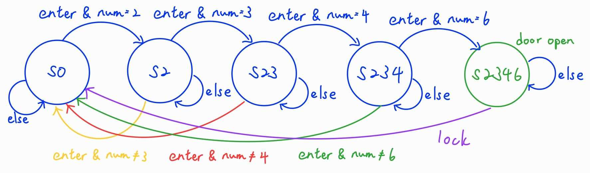
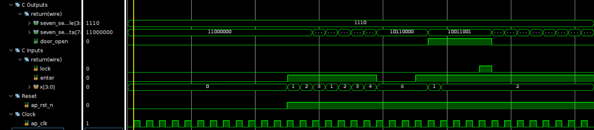
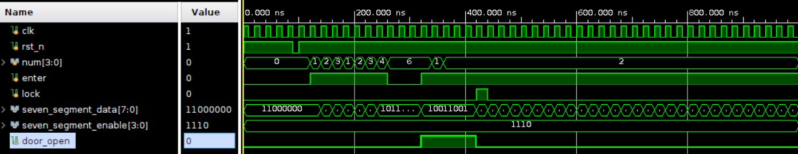
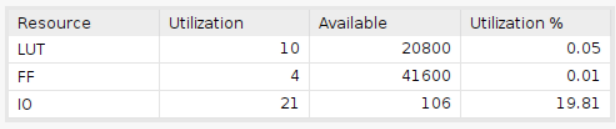
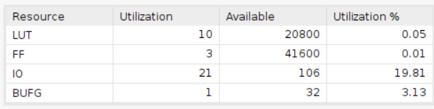
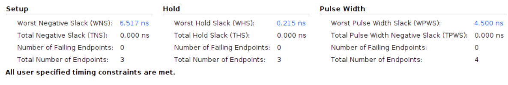

# Combinational Lock

Employing the Basys 3 board with a clock period of 10ns.

## Design

This design is to implement a combinational lock that requires to input a four-digit password to unlock. The password in this design is **2346**. The lock will be unlocked if the input code is correct. Otherwise, the lock will be locked. After the door is open, press lock button to lock the door again.

* Input Signals:
  * `clk`: This signal is the clock input.
  * `rst_n`: This signal is a low-active reset trigger.
  * `num`: This signal is the input number, which will be controlled by switch in the design.
  * `enter`: This signal is to enter the number selected.
  * `lock`: This signal is the lock button.
* Output Signals:
  * `seven_segment_data`: This signal is to show the user about the current state.
  * `seven_segment_enable`: This signal is to enable the seven segment display.
  * `door_open`: This signal is to show the user about the current state of the door.

The design is based on the FSM below:

## Result comparison

The utilization report indicates that the Vivado-designed implementation is more resource-efficient. Nonetheless, the timing report reveals that the HLS design exhibits a greater slack compared to the Verilog design. This disparity could potentially be attributed to the application of BUFG.

|Waveform||
|--------|--------|
|HLS||
|verilog||

The testbench simulates real-world scenarios to verify the lock's status. The following outlines the steps of the testbench:

1. Reset the lock.
2. num = 1, enter = 1.
3. num = 2, enter = 1.
4. num = 3, enter = 1.
5. num = 4, enter = 1.
6. num = 1, enter = 1.
7. num = 2, enter = 1.
8. num = 3, enter = 1.
9. num = 4, enter = 1.
10. num = 6, enter = 0.
11. num = 6, enter = 0.
12. num = 6, enter = 0.
13. num = 6, enter = 1.**The door is open**
14. num = 1, enter = 1.
15. num = 2, enter = 1.
16. num = 2, enter = 1.
17. num = 2, enter = 1.
18. num = 2, enter = 1, lock = 1.**The door is locked.**
19. num = 2, enter = 1, lock = 0.

The testbench results confirm the design's expected behavior. If the input code is accurate, the door will unlock and open; otherwise, it will remain locked.

|Utilization||
|--|--|
|HLS||
|verilog||

As depicted above, the utilization of LUTs is identical in both designs. However, in terms of flip-flops (FFs), the HLS design employs one additional FF compared to the Verilog-implemented design. Notably, the Verilog design incorporates one more BUFG than the HLS design, possibly to address clock signal buffering and synchronization requirements. This discrepancy might arise from the necessity of buffering and synchronizing the clock signal in the Verilog design.

|Timing||
|--------|--------|
|HLS||
|verilog||

The timing report indicates that the HLS design exhibits a larger slack than the Verilog design. This discrepancy in slack could potentially stem from the inclusion of BUFG in the Verilog design.