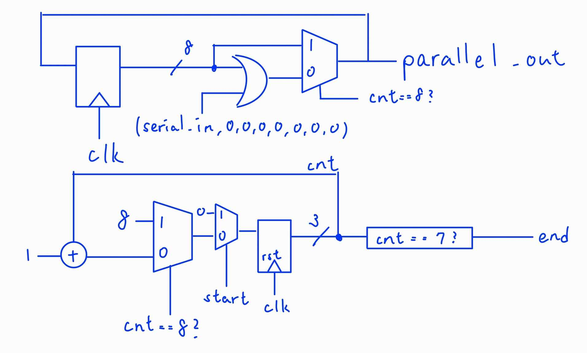
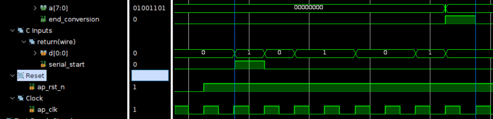
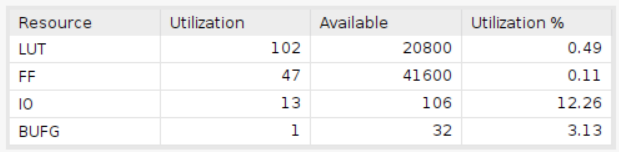
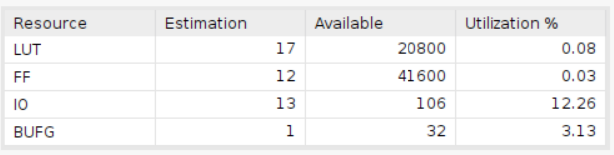
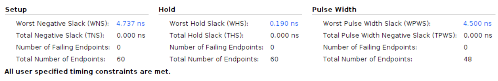
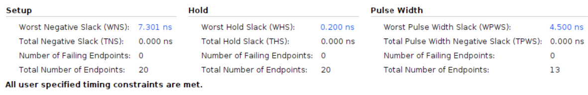

# Serial to Parallel

Employing the Basys 3 board with a clock period of 10ns.

## Design

This design is to convert the serial data to parallel data.

* Input Signals:
  * `clk`: This signal is the clock signal.
  * `rst_n`: This signal is a low-active reset signal.
  * `serial_start`: This signal indicates the start of the input.
  * `serial_in`: This signal is the input data.
* Output Signals:
  * `parallel_out`: This signal is the output data.
  * `parallel_end`: This signal indicates the end of the output.

The vivado design is based on the following diagram:

## Result comparison

The comparison of the design implemented by HLS and the design implemented by verilog is shown below.All imformations point out that the design implemented by verilog is more concise and efficient than the design implemented by HLS.

|Waveform  |        |
|--------|--------|
|HLS     ||
|verilog ||

From the waveform, we prove that both design act the same, converting serial data to parallel data.

|Utilization|                        |
|--         |--                      |
|HLS        ||
|verilog    ||

It is obvious that the design implemented by HLS uses six times as much LUTs as the design implemented by verilog and about four times the usage of FFs to that of the verilog design.

|Timing||
|--|--|
|HLS||
|verilog||

By timing report, we can find out that the design implemented by verilog has bigger slack than the design implemented by HLS, this might come from the reduncdant design implemented by HLS.