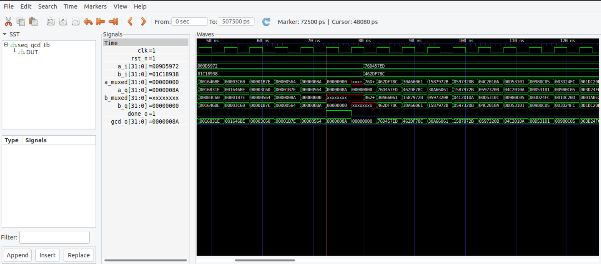

# Xsim gcd

## Description

The focus of this lab is to get familiar with the tool GTK-wave.

## Result

## Reference

[soclab-nthusp3_lab02](https://github.com/bol-edu/soclab-nthusp23/tree/f81a834fd3f262c57b35457863c81542c4b25bf1/lab/02.xsim-gcd)