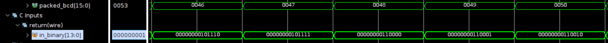

# Binary to BCD (by division)

Employing the Basys 3 board with a clock period of 10ns.

**In Vitis HLS, if the clock period is configured to be less than 20ns, the design will transform into a sequential circuit configuration due to the latency introduced. However, it's worth noting that the design is capable of completing within a single clock cycle of 10ns, as confirmed through verification in Vivado.**

## Design

This design is to convert the binary number to BCD number by division.

* Input signal:
  * `binary_in`: This signal is the input binary number.
* Output signal:
  * `bcd`:This signal represents the Binary Coded Decimal (BCD) number derived from the input binary signal.

The vivado design is based on the following diagram:

**Note that the modulus operation is implemented by subtraction, multiplication and division to keep the design combinational.**

## Result comparison

The comparison of the design implemented by HLS and the design implemented by verilog is shown below.The utilization report indicates that the design implemented by verilog is more concise and efficient than the design implemented by HLS.

|Waveform  |        |
|--------|--------|
|HLS     ||
|verilog ||

The result shows that both design convert binary into BCD.

|Utilization||
|--|--|
|HLS||
|verilog||

The primary distinction between the two designs lies in the usage of resources. The HLS-implemented design employs 3 DSPs, whereas the Verilog-implemented design avoids the use of any DSPs. Despite the HLS design's lower LUT consumption, it's important to note that DSPs are more resource-intensive than LUTs.