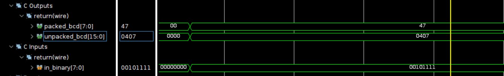
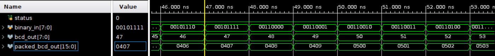
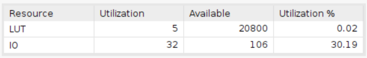
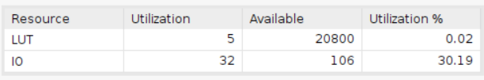

# Binary to BCD (by double dabble)

Employing the Basys 3 board with a clock period of 10ns.

**In Vitis HLS, if the clock period is configured to be less than 20ns, the design will transform into a sequential circuit configuration due to the latency introduced. However, it's worth noting that the design is capable of completing within a single clock cycle of 10ns, as confirmed through verification in Vivado.**

## Design

This design is to convert the binary number to BCD number by double dabble algorithm.

* Input signal:
  * `binary_in`: This signal is the input binary number.
* Output signal:
  * `bcd`:This signal represents the Binary Coded Decimal (BCD) number derived from the input binary signal.

The vivado design is based on the double dabble algorithm. The algorithm is shown below:

|   bcd_out    | binary_in |
|----------|----------|
|00000000 | xxxx xxxx|

1. Initialize 'bcd_out' to 0.
2. Left-shift the combined value of 'bcd_out' and 'binary_in' by 1 bit.
3. If the least significant digit of 'bcd_out' is 5 or greater, add 3 to the BCD number.
4. Repeat steps 2 to 3 until the binary number becomes 0.

**In this design(8-bit BCD), we perform 7 times step 2 and step 3 and one more time step 2.**

## Result comparison

The comparison of the design implemented by HLS and the design implemented by verilog is shown below. In this design, the utilization of the structure implemented by HLS and viado is identical.

| Waveform  |        |
|--------|--------|
|HLS     ||
|verilog ||

The result shows that both design are correct. (The input testcase of HLS  consist of one value 00101111 in binary and the output is 47 in BCD.)

|Utilization||
|--|--|
|HLS||
|verilog||

The results demonstrate that the utilization of both designs is precisely identical.
