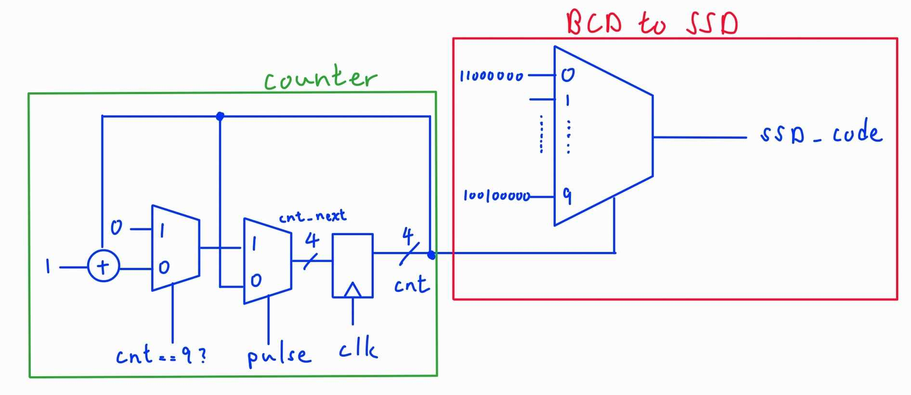
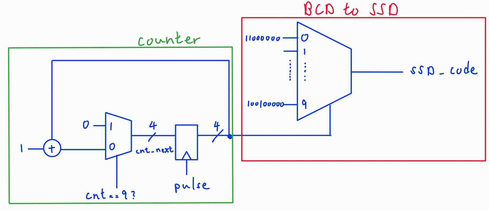
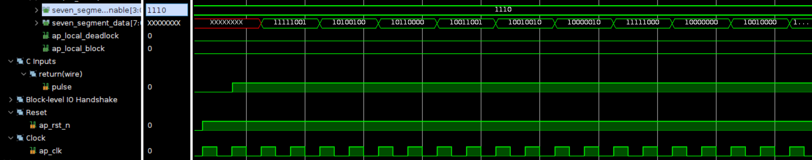
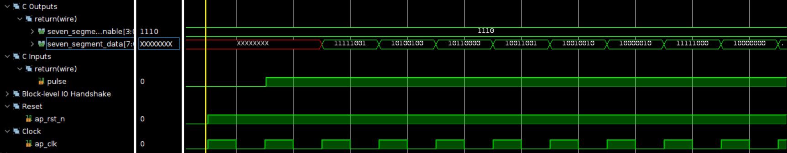
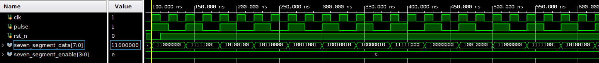
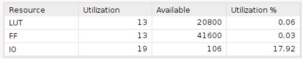
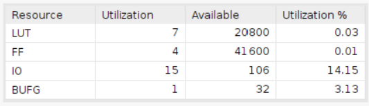
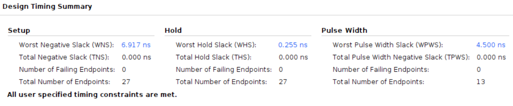
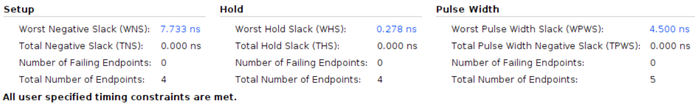

# One Digit BCD counter

Employing the Basys 3 board with a clock period of 10ns.

## Design

The purpose of this design is to count from 0 to 9 using BCD code and then showcase the count on a seven-segment display.

* Input Signals:
  * `clk`: This signal is the clock input.
  * `rst_n`: This signal is a low-active reset trigger.
  * `pulse`: This signal serves as the enable input for the counter.
* Output Signals:
  * `seven_segment_data`: This signal contains the data to be displayed on the seven-segment display.
  * `seven_segment_display`: This signal determines the specific seven-segment display to be utilized.

The vivado design is based on the following diagram:

**Please take into account that the design should employ an enabler to initiate the counter, rather than utilizing the 'pulse' signal as the 'clock' signal. This approach is necessary to avoid potential glitches that could arise. Below is the representation of the flawed design:**

## Result comparison

The provided comparison between the design implemented using HLS and the one implemented using Verilog highlights that the Verilog-based design is notably more succinct and resource-efficient in timing and utilization.

|Waveform  |        |
|--------|--------|
|HLS     ||
|HLS(pipelined) ||
|verilog ||

After examining the waveforms of both the pipelined and non-pipelined HLS designs, it becomes apparent that the non-pipelined design needs two clock cycles for setup, leading to a fifty percent chance of missed input pulses. Conversely, the pipelined design accomplishes its setup within a sole clock cycle.

To emphasize, all three waveforms collectively demonstrate that the module operates as intended, counting from 0 to 9 and subsequently resetting to 0.

|Utilization|                        |
|--         |--                      |
|HLS (pipelined)| |
|verilog    ||

As indicated by the provided utilization report, the HLS-designed implementation employs 13 LUTs and 13 FFs, whereas the Verilog-designed counterpart utilizes 7 LUTs and 4 FFs. The higher resource usage in the HLS design could be attributed to the application of the pipeline pragma, which instructs the design to be implemented as a pipelined structure. While this approach reduces cycle latency, it also consumes more resources, thus aligning more closely with the intended design goal.

Importantly, the inclusion of a BUFG (Buffered Clock Gate) in the Verilog design signifies the necessity for buffering and synchronization. This is likely crucial to ensure accurate clock distribution and effective management of signal propagation delays.

|Timing|        |
|--------|--------|
|HLS (pipelined)    ||
|verilog ||

Through the timing report, it becomes evident that the Verilog-implemented design possesses a larger slack compared to the design implemented using HLS. This variance in slack might arise from the potential redundancy within the HLS implementation.