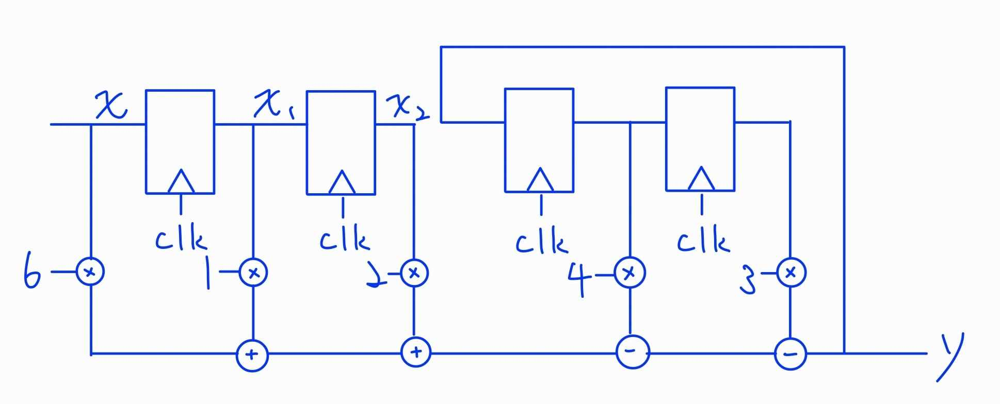
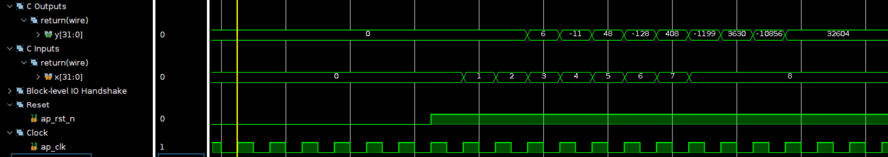
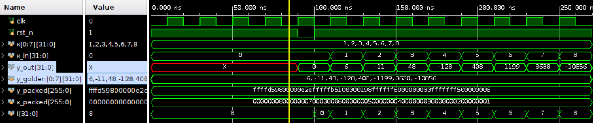
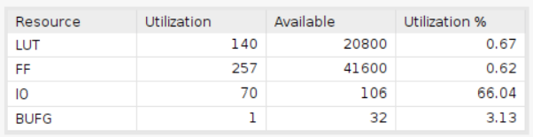
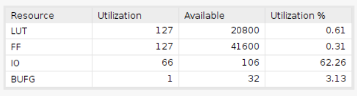
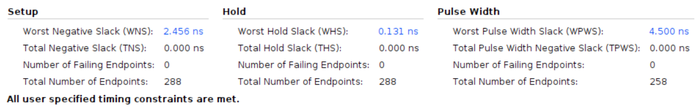
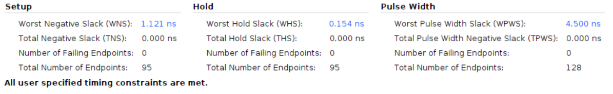

# Infinite Impulse Response (IIR) Filter

Employing the Basys 3 board with a clock period of 10ns.

## Design

The objective of this design is to implement a 2-nd order IIR filter. The filter is defined by the following difference equation:

    y = 6x + (x-1) + 2(x-2) - 4(y-1) - 3(y-2)

* Input Signal:
  * `x`: This signal is the input value.
* Output Signal:
  * `y`: This signal is the output value.

The structure of the filter is shown below:

## Result comparison

An in-depth comparison between the HLS-designed and Verilog-designed implementations yields valuable insights into resource utilization and timing performance. The Verilog implementation utilizes fewer resources compared to the HLS design, but it also requires more setup time. These facets underscore the complex balance that exists when choosing design methodologies, each contributing distinctively to the overall efficiency of the implementations.

|Waveform||
|--------|--------|
|HLS||
|Verilog||

Upon comparing the waveforms of the two designs, it becomes evident that both implementations are virtually identical and successfully fulfill their intended functionalities. The testbench simulates a scenario where input values range from 1 to 8. The approach involves generating the expected outputs and storing these values in a 2-D array, constituting the golden model. Subsequently, individual inputs are assigned, and outputs are calculated and compared against the golden model.

As depicted above, the calculations yield outputs of 6, -11, 48, -128, 408, -1199, 3630, and -10856. These values correspond to both the golden model and the response from the HLS design. The output confirmation attests to the IIR filter's effective computation.

|Utilization||
|--|--|
|HLS||
|Verilog||

In terms of LUT utilization, a close comparison can be observed between the HLS-designed and Verilog-designed implementations. The HLS design employs 140 LUTs, while the Verilog design utilizes 127 LUTs. However, a noticeable contrast arises in the employment of flip-flops (FFs). The HLS design utilizes 257 FFs, which is approximately double the number of FFs employed by the Verilog design (127 FFs). Broadly speaking, the HLS design consumes significantly more resources compared to the Verilog design.

|Timing||
|--|--|
|HLS||
|Verilog||

When examining the hold time slack, a meticulous comparison unveils a proximity between the HLS-designed and Verilog-designed implementations. Specifically, the HLS design features a hold time slack of 0.131 ns, while the corresponding figure for the Verilog design stands at 0.154 ns.

However, addressing the setup time slack, a discernible difference surfaces. The HLS design boasts approximately twice the magnitude of setup time slack in comparison to the Verilog design. This disparity could potentially be attributed to the fact that the HLS design incorporates a greater number of flip-flops (FFs) compared to the Verilog design. Consequently, this higher FF count enables faster calculations, thereby resulting in the reduction of setup time slack.
