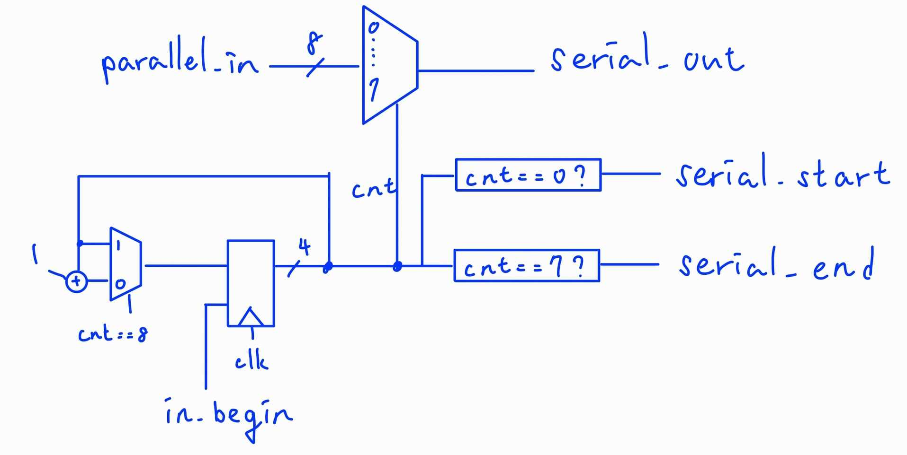
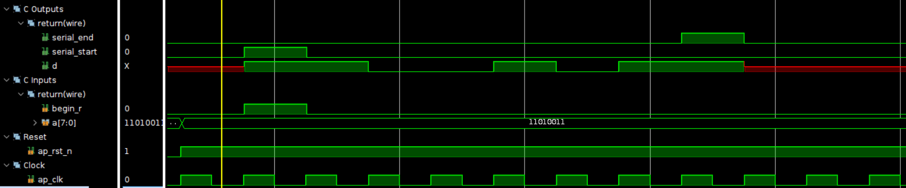
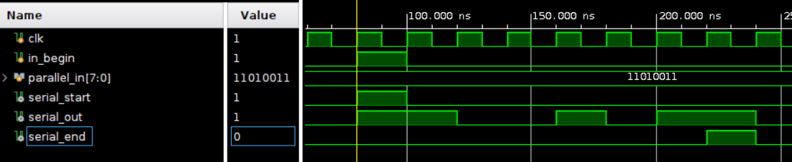
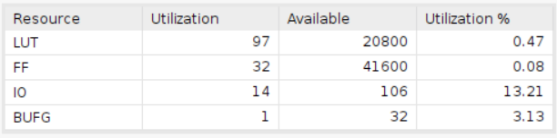
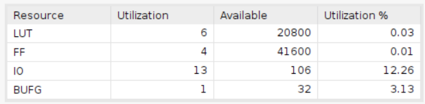
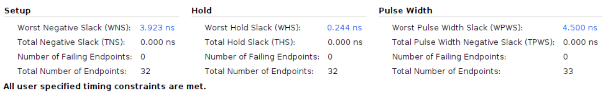
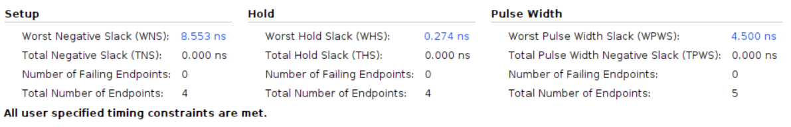

# Parallel to Serial

Employing the Basys 3 board with a clock period of 10ns.

## Design

This design is to convert the parallel data to serial data.

* Input Signals:
  * `clk`: This signal is the clock signal.
  * `in_begin`: This signal indicates the start of the input, acting as the reset signal.
  * `parallel_in`: This signal is the input data.
* Output Signals:
  * `serial_out`: This signal is the output data.
  * `serial_start`: This signal indicates the start of the output.
  * `serial_end`: This signal indicates the end of the output.

The vivado design is based on the following diagram:

## Result comparison

The comparison of the design implemented by HLS and the design implemented by verilog is shown below.All imformations point out that the design implemented by verilog is more concise and efficient than the design implemented by HLS.

|Waveform  |        |
|--------|--------|
|HLS     ||
|verilog ||

We can easily see that both design acts the same from the waveform.

|Utilization|                        |
|--         |--                      |
|HLS        | |
|verilog    |  |

However, the design implemented by HLS uses a great amount of LUTs and FFs than the design implemented by verilog.

|Timing||
|--|--|
|HLS||
|verilog||

By timing report, we can find out that the design implemented by verilog has bigger slack than the design implemented by HLS, this might come from the reduncdant design implemented by HLS.
