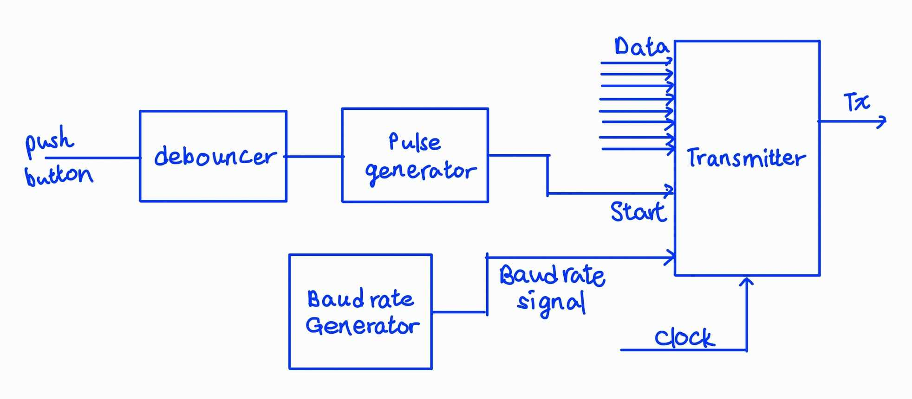
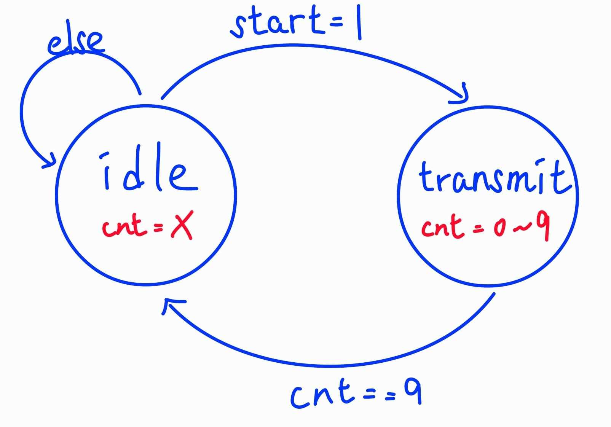
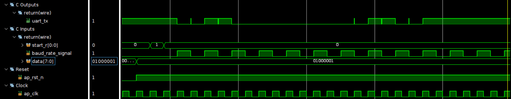
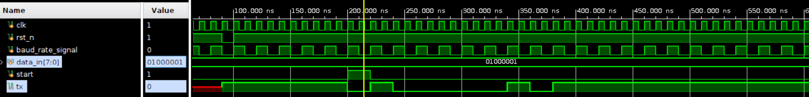
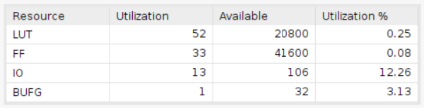
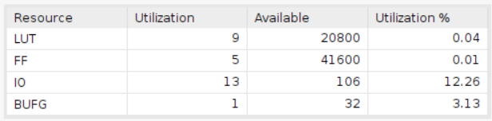
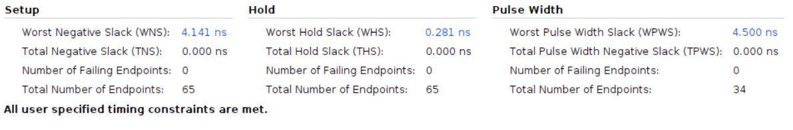
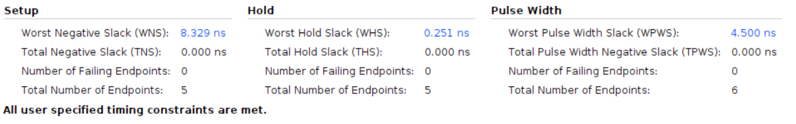

# UART Transmitter

This design is to create an UART transmitter. An UART transmitter facilitates serial communication by converting parallel data into a synchronized bit stream. It adds start and stop bits to create data frames, enabling clock-independent data transfer between devices.

## Design

* Input signals
  * `clk`: This signal is the clock signal.
  * `rst_n`: This signal is the active low reset signal.
  * `baud_rate_signal`: This signal is the baud rate signal.
  * `data`: This signal is the parallel input data.
  **Please take note that the start bit is represented by a logic 0, whereas the stop bit is represented by a logic 1.**
  * `start`: This signal instructs the transmitter to initiate the data transmission process.
* Output signals
  * `tx`: This signal represents the serial output data, encompassing the start signal, the input parallel data, and the stop signal.

The provided diagram portrays the block diagram of the UART transmitter in real-world application. To facilitate proper functionality, the integration of certain components is essential. Specifically, a debouncer is required to mitigate signal noise in the `start` input derived from the push-button. Furthermore, a pulse generator is necessary to create a single-cycle pulse. In addition, a baud rate generator becomes indispensable to generate a synchronized baud rate signal that aligns with the UART receiver's operation.

The following depiction illustrates the Finite State Machine (FSM) for the UART kernel design. The transmitter initially resides in the "idle" state until the `start` signal is received. Upon detecting the `start` signal, the transmitter transitions into the "transmit" state. In this state, the transmitter proceeds to transmit the start bit, followed by the input data, and finally the stop bit. Upon completing the transmission of the stop bit, the transmitter reverts to the "idle" state. Notably, a counter will be employed to sequentially record the current bit position as it counts from 0 to 9.

| Waveform design |      |          |    |    |    |    |    |    |    |    |          |      |
|-----------------|:----:|:--------:|:--:|:--:|:--:|:--:|:--:|:--:|:--:|:--:|:--------:|:----:|
| start           |   0  |     1    |  0 |  0 |  0 |  0 |  0 |  0 |  0 |  0 |     0    |   0  |
| tx              |   1  | 0(start) | D0 | D1 | D2 | D3 | D4 | D5 | D6 | D7 |  1(stop) |   1  |
| state           | idle | transmit |  - |  - |  - |  - |  - |  - |  - |  - | transmit | idle |
| cnt             |   X  |     0    |  1 |  2 |  3 |  4 |  5 |  6 |  7 |  8 |     9    |   X  |

## Result comparison

Upon thorough examination of both the utilization and timing reports, it becomes evident that the Verilog design surpasses the HLS design in terms of efficiency.

|Waveform||
|--|--|
|HLS||
|Verilog||

The waveform demonstrates that the UART transmitter effectively transmits the data, incorporating the start bit, parity bit, and stop bit into the provided data stream.

|Utilization||
|--|--|
|HLS||
|Verilog||

When evaluating resource efficiency, the Verilog design clearly stands out with a significant advantage. It employs merely 9 LUTs and 5 FFs. In contrast, the HLS design utilizes 52 LUTs and 33 FFs, representing a substantial increase of around 4 times in LUT usage and 6 times in FF usage.

|Timing||
|--|--|
|HLS||
|Verilog||

Regarding timing performance, the Verilog design gains a landslide victory. It exhibits a substantial setup slack of 8.329ns, which is approximately twice the setup slack of the HLS design (4.141ns). The hold time slack shows no significant difference between the two designs.
