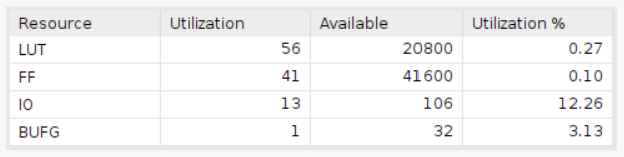

# UART Receiver

This design is to create an UART receiver. An UART receiver facilitates serial communication by converting a synchronized bit stream into parallel data. It removes the start and stop bits to extract the data frames, enabling clock-independent data transfer between devices.

## Design

* Input signals
  * `clk`: This signal is the clock signal.
  * `rst_n`: This signal is the active low reset signal.
  * `baud_rate_signal`: This signal is the baud rate signal.
  * `rx`: This signal represents the serial input data, encompassing the start signal, the input parallel data, and the stop signal.
* Output signals
  * `data`: This signal represents the parallel data output.
  * `valid`: This signal represents the valid signal.

The design is grounded in the subsequent Finite State Machine (FSM).

 Upon reset, the receiver enters the "idle" state. Upon detecting a start bit (a logic zero) from the rx input, the receiver shifts into the "receive" state. Simultaneously, the counter is initialized to zero. With each subsequent occurrence of a one in the baud rate signal, the counter increments by one, and the incoming data is stored in the corresponding flip-flop, data[cnt]. Once the counter reaches a count of 8, the receiver transitions back to the "idle" state, setting the valid signal to 1 and wait for the next start.

| Waveform design |      |          |    |    |    |    |    |    |    |    |         |      |
|-----------------|:----:|:--------:|:--:|:--:|:--:|:--:|:--:|:--:|:--:|:--:|:-------:|:----:|
| rx              |   1  | 0(start) | D0 | D1 | D2 | D3 | D4 | D5 | D6 | D7 | 1(stop) |   1  |
| state           | idle |  receive |  - |  - |  - |  - |  - |  - |  - |  - | receive | idle |
| cnt             |   X  |     0    |  1 |  2 |  3 |  4 |  5 |  6 |  7 |  8 |    9    |   X  |
| valid           | 0    | 0        | 0  | 0  | 0  | 0  | 0  | 0  | 0  | 0  | 1       | 0    |

## Result Comparison

The outcomes indicate that both designs accomplish the same task. Nonetheless, the HLS design consumes significantly more resources compared to the Verilog design. Concurrently, the Verilog design exhibits superior timing performance.

|Waveform||
|--|--|
|HLS||
|Verilog||

The waveform of the verilog shows that the design successfully receives the dataform and outputs the data and the valid signal.

|Utilization||
|--|--|
|HLS||
|Verilog||

When evaluating resource efficiency, the Verilog design clearly stands out with a significant advantage. It employs merely 14 LUTs and 14 FFs. In contrast, the HLS design utilizes 56 LUTs and 42 FFs, representing a substantial increase of around 4 times in LUT usage and 3 times in FF usage.

|Timing||
|--|--|
|HLS||
|Verilog||

Regarding timing performance, the Verilog design gains a landslide victory. It exhibits a substantial setup slack of 7.408ns, which is approximately twice the setup slack of the HLS design (3.911ns). The hold time slack shows no significant difference between the two designs.
